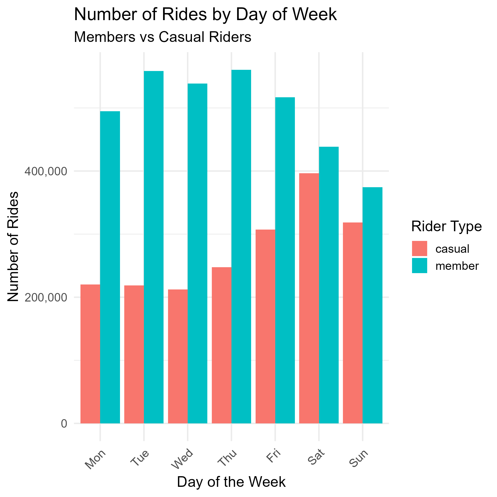
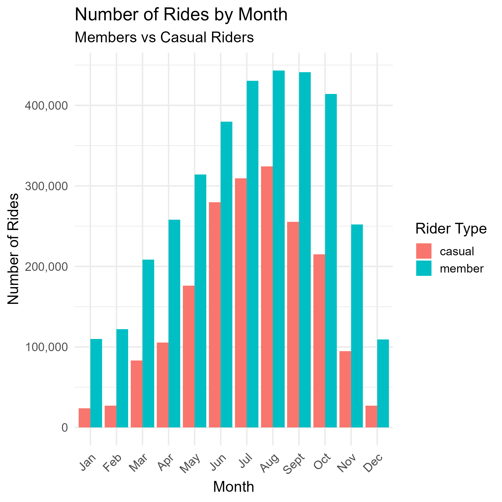
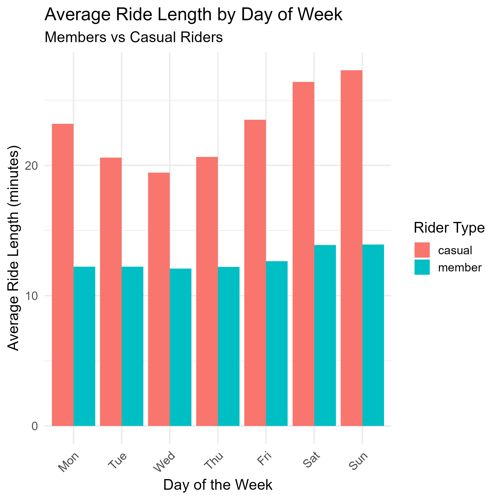

# 🚴 Cyclistic Bike-Share Analysis

## 📌 Overview

This project presents an end-to-end data analysis of Cyclistic bike-share data as part of the Google Data Analytics Certificate capstone.

The analysis covers over **5.5 million bike-share trips (February 2025 to January 2026)** and focuses on understanding how different rider types use the service. The goal is to generate insights that support marketing strategies aimed at converting casual riders into annual members.

🔗 **[View Full Report (RPubs)](https://rpubs.com/DanielEniola/cyclistic-bike-share-analysis)**
🔗 **[View Kaggle Notebook](https://www.kaggle.com/code/danieleniola/cyclistic-bike-share-analysis)**

---

## ❓ Business Question

**How do annual members and casual riders use Cyclistic bikes differently?**

This question is explored through data cleaning, feature engineering, exploratory analysis, and visualization.

---

## 🛠 Tools & Technologies

* **R**: data cleaning, analysis, and visualization
* **tidyverse**: data manipulation
* **ggplot2**: data visualization
* **scales**: formatting and presentation

---

## 🔍 Project Highlights

* Processed and analyzed **5,552,092 ride records**
* Cleaned data by removing **148,401 invalid rides** (under 1 minute or negative durations)
* Engineered new variables such as ride length, day of week, and month
* Identified behavioral patterns using grouped summaries and visualizations
* Translated insights into **actionable business recommendations**

---

## 🔍 Key Insights

* Casual riders average **23.5 minutes per ride**, nearly **2 times longer** than members (12.7 minutes)
* Members take significantly more rides (**3.48 million vs 1.92 million**), indicating higher usage frequency
* Casual riders peak on **weekends**, especially Saturday and Sunday, showing leisure behavior
* Members ride more frequently on **weekdays**, suggesting commuting and routine usage
* Casual ridership is highly **seasonal**, with sharp declines in winter, while members remain relatively consistent year-round

---

## 📊 Visualisations

---

## 💡 Recommendations

* 📈 Launch targeted **weekend conversion campaigns** starting Thursday to capture peak casual usage
* 🚲 Position memberships as a solution for **weekday convenience and short trips**
* 🌤 Introduce **pre-summer promotions (March to April)** to convert riders before peak season

---

## 📁 Project Files

* `cyclistic_analysis.Rmd`: full analysis with code and methodology
* `cyclistic_analysis.html`: interactive report
* `cyclistic_analysis.pdf`: presentation-ready report
* `.png` files: exported visualizations

---

## 📊 Data Source

[Divvy Trip Data](https://divvy-tripdata.s3.amazonaws.com/index.html)
Provided by Motivate International Inc. under public license.

---

*Analysis completed by Daniel Eniola*
